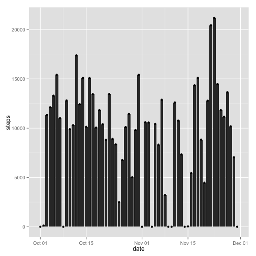
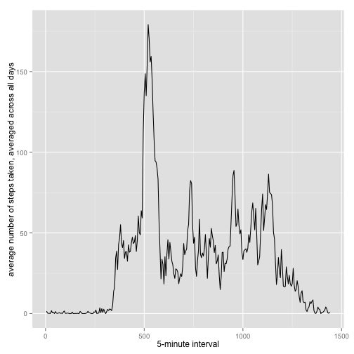
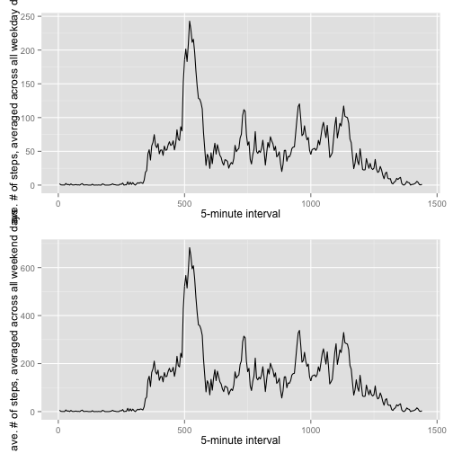

## Loading and preprocessing the data


```r
# 1. Load the data (i.e. read.csv())
data <- read.csv("./Peer Assessment/activity.csv")
```

```
## Warning in file(file, "rt"): cannot open file './Peer
## Assessment/activity.csv': No such file or directory
```

```
## Error in file(file, "rt"): cannot open the connection
```

```r
# 2. Process/transform the data (if necessary) into a format suitable for your analysis
## Removes rows with NA 
data1 <- na.omit(data)
## Changes class to Date
data1$date <- as.Date(as.character(data1$date), format="%Y-%m-%d")
## Sum all steps by date
data2 <- aggregate(data1$steps, by = list(date = data1$date), FUN = sum)
## Change column name
colnames(data2)[2] <- c("steps")
```

## What is mean total number of steps taken per day?


```r
# 1. Make a histogram of the total number of steps taken each day
if(suppressWarnings(!require("ggplot2"))) {
                install.packages("ggplot2")
        }
library("ggplot2")
g <- ggplot(data2, aes(date, steps)) + geom_histogram(stat = "identity")
p <- g + geom_point()
print(p)
```

 


```r
mean <- mean(data2$steps)
median <- median(data2$steps)
options(scipen = 1, digits = 2)
```

The mean and median total number of steps taken per day are 9354.23 and 10395 respectively.

## What is the average daily activity pattern?


```r
# 1. Make a time series plot (i.e. type = "l") of the 5-minute interval (x-axis) and the average number of steps taken, averaged across all days (y-axis)

## Sum all steps by date
data3 <- aggregate(data1$steps, by = list(date = data1$interval), FUN = sum)
## Change column name
colnames(data3)[1] <- c("interval")
colnames(data3)[2] <- c("steps")

length <- length(data3$interval)
ndays <- length(data2$date)

# Create column with average no. of steps across all days
avestep <- vector(length = length)
for(i in 1:length) {
        avestep[i] <- data3$steps[i]/ndays
}
data3 <- cbind(data3, avestep)

# Format interval column
for(i in 1:length) {
        data3$interval[i] <- i*5
}

# Plot 
g <- ggplot(data3, aes(interval, avestep))
p <- g + geom_line() + labs(x = "5-minute interval") + labs(y = "average number of steps taken, averaged across all days")
print(p)
```

 

```r
# 2. Which 5-minute interval, on average across all the days in the dataset, contains the maximum number of steps?
max <- max(data3$avestep)
optinterval <- subset(data3, avestep == max)
optinterval <- optinterval$interval
```

On average across all the days in the dataset, the interval 520 contains the maximum number of steps.

## Imputing missing values


```r
# 1. Calculate and report the total number of missing values in the dataset (i.e. the total number of rows with NAs)

nas <- sum(is.na(data$steps))
```

The total number of missing values in the dataset is of 0.


```r
# 2. Devise a strategy for filling in all of the missing values in the dataset. The strategy does not need to be sophisticated. For example, you could use the mean/median for that day, or the mean for that 5-minute interval, etc.
# 3. Create a new dataset that is equal to the original dataset but with the missing data filled in.
if(suppressWarnings(!require("rrcovNA"))) {
                install.packages("rrcovNA")
        }
library("rrcovNA")
data[is.na(data)] <- 0

# 4. Make a histogram of the total number of steps taken each day and Calculate and report the mean and median total number of steps taken per day. Do these values differ from the estimates from the first part of the assignment? What is the impact of imputing missing data on the estimates of the total daily number of steps?

## Changes class to Date
data$date <- as.Date(as.character(data$date), format="%Y-%m-%d")
## Sum all steps by date
data4 <- aggregate(data$steps, by = list(date = data$date), FUN = sum)
## Change column name
colnames(data4)[2] <- c("steps")
## Plot
g1 <- ggplot(data4, aes(date, steps)) + geom_histogram(stat = "identity")
p1 <- g1 + geom_point()
print(p1)
```

 

```r
## Mean & Median
meanfor4 <- mean(data4$steps)
medianfor4 <- median(data4$steps)
options(scipen = 1, digits = 2)
```

The mean and median total number of steps taken per day are 9354.23 and 10395 respectively.


```r
# Do these values differ from the estimates from the first part of the assignment? What is the impact of imputing missing data on the estimates of the total daily number of steps?
```

The mean and median total number of steps taken per day are differed from the estimates from the first part of the assignment.
After imputting missing data on the estimates of the total daily number of steps, the mean and median total number of steaps taken per day decreased. It indeed went from 9354.23 and 10395 to 9354.23 and 10395.


## Are there differences in activity patterns between weekdays and weekends?


```r
# 1. Create a new factor variable in the dataset with two levels – “weekday” and “weekend” indicating whether a given date is a weekday or weekend day.
day <- sapply(data4$date, weekdays)
length5a <- length(data4$date)
for(i in 1:length5a){
        if (day[i] == "Monday" | day[i] == "Tuesday" | day[i] == "Wednesday" | day[i] == "Thursday" | day[i] == "Friday")  {
                day[i] <- c("weekday")
        } else {
                day [i] <- c("weekend")
        }
        }
data5_1 <- cbind(data4, day)
head(data5_1)
```

```
##         date steps     day
## 1 2012-10-01     0 weekday
## 2 2012-10-02   126 weekday
## 3 2012-10-03 11352 weekday
## 4 2012-10-04 12116 weekday
## 5 2012-10-05 13294 weekday
## 6 2012-10-06 15420 weekend
```

```r
tail(data5_1)
```

```
##          date steps     day
## 56 2012-11-25 11834 weekend
## 57 2012-11-26 11162 weekday
## 58 2012-11-27 13646 weekday
## 59 2012-11-28 10183 weekday
## 60 2012-11-29  7047 weekday
## 61 2012-11-30     0 weekday
```

```r
# 2. Make a panel plot containing a time series plot (i.e. type = "l") of the 5-minute interval (x-axis) and the average number of steps taken, averaged across all weekday days or weekend days (y-axis). See the README file in the GitHub repository to see an example of what this plot should look like using simulated data.
data5b <- aggregate(data$steps, by = list(interval = data$interval), FUN = sum)
## Change column name
colnames(data5b)[2] <- c("steps")
length5b <- length(data5b$interval)

# Number of weekdays and weekend days
nweekday <- length(subset(data5_1$date, day == "weekday"))
nweekend <- length(subset(data5_1$date, day == "weekend"))

# Create column with average no. of steps across weekdays
avestepweekday <- vector(length = length5b)
avestepweekend <- vector(length = length5b)
for(i in 1:length5b) {
        avestepweekday[i] <- data5b$steps[i]/nweekday
}
for(i in 1:length5b) {
        avestepweekend[i] <- data5b$steps[i]/nweekend
}
data5b <- cbind(data5b, avestepweekday, avestepweekend)

# Format interval column
for(i in 1:length) {
        data5b$interval[i] <- i*5
}

head(data5b)
```

```
##   interval steps avestepweekday avestepweekend
## 1        5    91          2.022           5.69
## 2       10    18          0.400           1.12
## 3       15     7          0.156           0.44
## 4       20     8          0.178           0.50
## 5       25     4          0.089           0.25
## 6       30   111          2.467           6.94
```

```r
tail(data5b)
```

```
##     interval steps avestepweekday avestepweekend
## 283     1415   138           3.07           8.62
## 284     1420   249           5.53          15.56
## 285     1425   175           3.89          10.94
## 286     1430    34           0.76           2.12
## 287     1435    12           0.27           0.75
## 288     1440    57           1.27           3.56
```

```r
# Plot
g2 <- ggplot(data5b, aes(interval, avestepweekday))
p2 <- g2 + geom_line() + labs(x = "5-minute interval") + labs(y = "ave. # of steps, averaged across all weekday days")

g3 <- ggplot(data5b, aes(interval, avestepweekend))
p3 <- g3 + geom_line() + labs(x = "5-minute interval") + labs(y = "ave. # of steps, averaged across all weekend days")

theme(text = element_text(size=1), axis.text.y = element_text(size = rel(1))) 
```

```
## List of 2
##  $ text       :List of 8
##   ..$ family    : NULL
##   ..$ face      : NULL
##   ..$ colour    : NULL
##   ..$ size      : num 1
##   ..$ hjust     : NULL
##   ..$ vjust     : NULL
##   ..$ angle     : NULL
##   ..$ lineheight: NULL
##   ..- attr(*, "class")= chr [1:2] "element_text" "element"
##  $ axis.text.y:List of 8
##   ..$ family    : NULL
##   ..$ face      : NULL
##   ..$ colour    : NULL
##   ..$ size      :Class 'rel'  num 1
##   ..$ hjust     : NULL
##   ..$ vjust     : NULL
##   ..$ angle     : NULL
##   ..$ lineheight: NULL
##   ..- attr(*, "class")= chr [1:2] "element_text" "element"
##  - attr(*, "class")= chr [1:2] "theme" "gg"
##  - attr(*, "complete")= logi FALSE
```

```r
if(suppressWarnings(!require("gridExtra"))) {
                install.packages("gridExtra")
        }
library("gridExtra")

grid.arrange(p2, p3)
```

 
